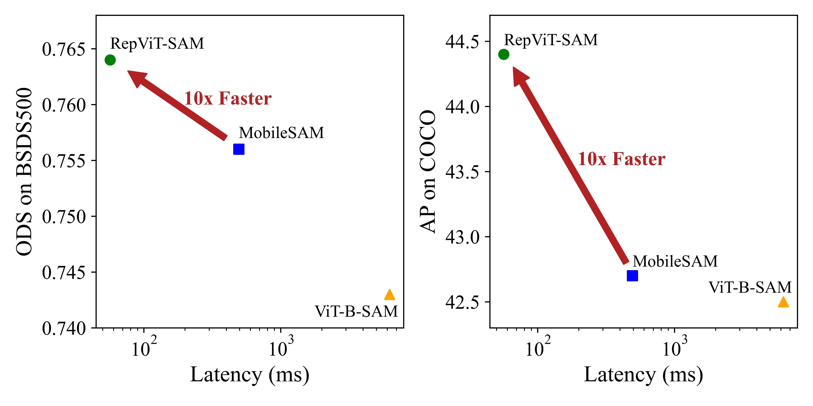
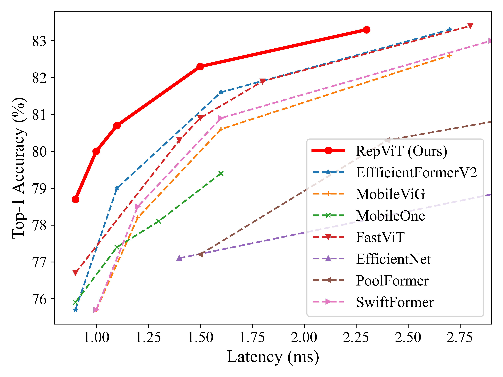
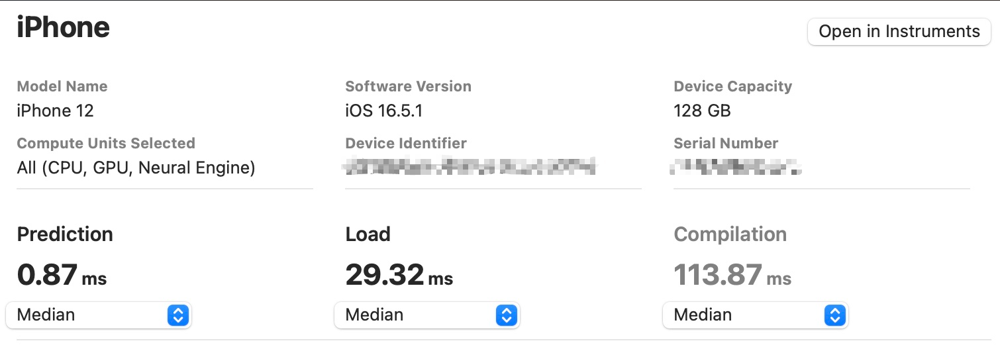

# RepViT-VAD: Video Anomaly Detection with RepViT-M1.0 + TCN

A real-time **Video Anomaly Detection** system built using **RepViT-M1.0** backbone + **Temporal Convolutional Network (TCN)** + **Sigmoid Anomaly Head**, with **INT8 Quantization-Aware Training (QAT)** and **RISC-V ONNX deployment** support.

---

## 🏗 Model Architecture

| Component | Details |
|:---|:---|
| **Backbone** | RepViT-M1.0 (448-dim features, ~1ms latency) |
| **Temporal Module** | Temporal Convolutional Network (TCN) |
| **Anomaly Head** | Global Average Pooling + MLP + Sigmoid |
| **Output** | Anomaly Score ∈ [0.0, 1.0] |
| **Quantization** | QAT → INT8 (fbgemm backend) |
| **Deployment** | ONNX → RISC-V AI Accelerator |

---

## 📦 Dataset Download

> ⚠️ The dataset is **NOT included** in this repository due to large file sizes.
> Please download it from Google Drive below and place it in the correct folder.

### 🔗 Download Dataset
👉 **[Click here to download dataset from Google Drive](YOUR_GOOGLE_DRIVE_LINK_HERE)**

### 📂 Place Dataset in this Structure
After downloading, unzip and place as follows:

```
RepViT-VAD/
└── extracted_frames/
    └── train/
        ├── fighting/        ← Anomaly video frame folders
        │   ├── Fighting001/
        │   │   ├── frame_001.jpg
        │   │   └── ...
        │   └── Fighting002/
        └── normal/          ← Normal video frame folders
            ├── Normal001/
            └── Normal002/
```

---

## 🚀 Setup & Installation

```bash
# 1. Clone this repository
git clone https://github.com/adithya-0205/RepViT-VAD.git
cd RepViT-VAD

# 2. Create virtual environment
python -m venv venv
venv\Scripts\activate      # Windows
# source venv/bin/activate  # Linux/Mac

# 3. Install dependencies
pip install -r requirements.txt
```

---

## 🏋️ Training

```bash
python train.py
```

- Training runs for **10 epochs** by default
- Best model is saved to `best_model.pth` automatically
- Loss: `BCELoss` | Optimizer: `Adam (lr=1e-4)`

---

## 📊 Results (Our Training)

| Epoch | Train Loss | Val Accuracy |
|:---:|:---:|:---:|
| 7 | 0.5660 | 65.00% |
| 8 | 0.4936 | 70.00% |
| 9 | 0.5760 | 80.00% |
| **Best** | - | **85.00%** |

---

## ⚡ Quantization (QAT → INT8)

```bash
python qat_train.py
```
Saves quantized model to `repvit_m1_0_tcn_int8.pth`

---

## 🔧 ONNX Export for RISC-V Deployment

```bash
# Dynamic shapes (default)
python export_riscv_onnx.py

# Static shapes (for NPU hardware compilers)
python export_riscv_onnx.py --static
```
Exports to `repvit_m1_0_tcn_riscv.onnx`

---

## 📁 Project Structure

```
RepViT-VAD/
├── models/
│   ├── repvit_backbone.py   ← RepViT-M1.0 backbone
│   ├── tcn.py               ← Temporal Convolutional Network
│   └── vad_model.py         ← Full VAD model (Backbone + TCN + Head)
├── model/
│   └── repvit.py            ← RepViT model definitions
├── train.py                 ← Training script
├── qat_train.py             ← QAT INT8 quantization script
├── export_riscv_onnx.py     ← ONNX export for RISC-V
├── video_dataset.py         ← Dataset loader
├── extract_frames.py        ← Extract frames from raw videos
└── requirements.txt
```

---

## 📜 Citation

```bibtex
@inproceedings{wang2024repvit,
  title={Repvit: Revisiting mobile cnn from vit perspective},
  author={Wang, Ao and Chen, Hui and Lin, Zijia and Han, Jungong and Ding, Guiguang},
  booktitle={CVPR},
  year={2024}
}
```


Official PyTorch implementation of **RepViT-SAM** and **RepViT**. CVPR 2024.

<p align="center">
   <br>
  Models are deployed on iPhone 12 with Core ML Tools to get latency.
</p>

<p align="center">
   <br>
  Models are trained on ImageNet-1K and deployed on iPhone 12 with Core ML Tools to get latency.
</p>


[RepViT-SAM: Towards Real-Time Segmenting Anything](https://arxiv.org/abs/2312.05760).\
Ao Wang, Hui Chen, Zijia Lin, Jungong Han, and Guiguang Ding\
[[`arXiv`](https://arxiv.org/abs/2312.05760)] [[`Project Page`](https://jameslahm.github.io/repvit-sam)]

<details>
  <summary>
  <font size="+1">Abstract</font>
  </summary>
Segment Anything Model (SAM) has shown impressive zero-shot transfer performance for various computer vision tasks recently. However, its heavy computation costs remain daunting for practical applications. MobileSAM proposes to replace the heavyweight image encoder in SAM with TinyViT by employing distillation, which results in a significant reduction in computational requirements. However, its deployment on resource-constrained mobile devices still encounters challenges due to the substantial memory and computational overhead caused by self-attention mechanisms. Recently, RepViT achieves the state-of-the-art performance and latency trade-off on mobile devices by incorporating efficient architectural designs of ViTs into CNNs. Here, to achieve real-time segmenting anything on mobile devices, following, we replace the heavyweight image encoder in SAM with RepViT model, ending up with the RepViT-SAM model. Extensive experiments show that RepViT-SAM can enjoy significantly better zero-shot transfer capability than MobileSAM, along with nearly $10\times$ faster inference speed.
</details>

<br/>

[RepViT: Revisiting  Mobile CNN From ViT Perspective](https://arxiv.org/abs/2307.09283).\
Ao Wang, Hui Chen, Zijia Lin, Jungong Han, and Guiguang Ding\
[[`arXiv`](https://arxiv.org/abs/2307.09283)]

<details>
  <summary>
  <font size="+1">Abstract</font>
  </summary>
Recently, lightweight Vision Transformers (ViTs) demonstrate superior performance and lower latency compared with lightweight Convolutional Neural Networks (CNNs) on resource-constrained mobile devices. This improvement is usually attributed to the multi-head self-attention module, which enables the model to learn global representations. However, the architectural disparities between lightweight ViTs and lightweight CNNs have not been adequately examined. In this study, we revisit the efficient design of lightweight CNNs and emphasize their potential for mobile devices. We incrementally enhance the mobile-friendliness of a standard lightweight CNN, specifically MobileNetV3, by integrating the efficient architectural choices of lightweight ViTs. This ends up with a new family of pure lightweight CNNs, namely RepViT. Extensive experiments show that RepViT outperforms existing state-of-the-art lightweight ViTs and exhibits favorable latency in various vision tasks. On ImageNet, RepViT achieves over 80\% top-1 accuracy with 1ms latency on an iPhone 12, which is the first time for a lightweight model, to the best of our knowledge. Our largest model, RepViT-M2.3, obtains 83.7\% accuracy with only 2.3ms latency.
</details>

<br/>


<br/>

**UPDATES** 🔥
- 2023/12/17: [Grounding-SAM](https://github.com/IDEA-Research/Grounded-Segment-Anything/tree/main) supports RepViT-SAM with [Grounded-RepViT-SAM](https://github.com/IDEA-Research/Grounded-Segment-Anything/tree/main/EfficientSAM#run-grounded-repvit-sam-demo). Thanks!
- 2023/12/11: RepViT-SAM has been released. Please refer to [RepViT-SAM](./sam/README.md).
- 2023/12/11: RepViT-M0.6 has been released, achieving 74.1% with ~0.6ms latency. Its checkpoint is [here](https://github.com/THU-MIG/RepViT/releases/download/v1.0/repvit_m0_6_distill_300e.pth)
- 2023/09/28: RepViT-M0.9/1.0/1.1/1.5/2.3 models have been released.
- 2023/07/27: RepViT models have been integrated into timm. See https://github.com/huggingface/pytorch-image-models/pull/1876.

<br/>

## Classification on ImageNet-1K

### Models

| Model | Top-1 (300 / 450)| #params | MACs | Latency | Ckpt | Core ML | Log |
|:---------------|:----:|:---:|:--:|:--:|:--:|:--:|:--:|
| M0.9 |   78.7 / 79.1  |     5.1M    |   0.8G   |      0.9ms     |  [300e](https://github.com/THU-MIG/RepViT/releases/download/v1.0/repvit_m0_9_distill_300e.pth) / [450e](https://github.com/THU-MIG/RepViT/releases/download/v1.0/repvit_m0_9_distill_450e.pth)    |   [300e](https://github.com/THU-MIG/RepViT/releases/download/v1.0/repvit_m0_9_distiall_300e_224.mlmodel) / [450e](https://github.com/THU-MIG/RepViT/releases/download/v1.0/repvit_m0_9_distiall_450e_224.mlmodel)  | [300e](./logs/repvit_m0_9_distill_300e.txt) / [450e](./logs/repvit_m0_9_distill_450e.txt) |
| M1.0 |   80.0 / 80.3   |     6.8M    |   1.1G   |      1.0ms     | [300e](https://github.com/THU-MIG/RepViT/releases/download/v1.0/repvit_m1_0_distill_300e.pth) / [450e](https://github.com/THU-MIG/RepViT/releases/download/v1.0/repvit_m1_0_distill_450e.pth)    |   [300e](https://github.com/THU-MIG/RepViT/releases/download/v1.0/repvit_m1_0_distiall_300e_224.mlmodel) / [450e](https://github.com/THU-MIG/RepViT/releases/download/v1.0/repvit_m1_0_distiall_450e_224.mlmodel)  | [300e](./logs/repvit_m1_0_distill_300e.txt) / [450e](./logs/repvit_m1_0_distill_450e.txt) |
| M1.1 |   80.7 / 81.2   |     8.2M    |   1.3G   |      1.1ms     | [300e](https://github.com/THU-MIG/RepViT/releases/download/v1.0/repvit_m1_1_distill_300e.pth) / [450e](https://github.com/THU-MIG/RepViT/releases/download/v1.0/repvit_m1_1_distill_450e.pth)    |   [300e](https://github.com/THU-MIG/RepViT/releases/download/v1.0/repvit_m1_1_distiall_300e_224.mlmodel) / [450e](https://github.com/THU-MIG/RepViT/releases/download/v1.0/repvit_m1_1_distiall_450e_224.mlmodel)  | [300e](./logs/repvit_m1_1_distill_300e.txt) / [450e](./logs/repvit_m1_1_distill_450e.txt) |
| M1.5 |   82.3 / 82.5   |     14.0M    |   2.3G   |      1.5ms     | [300e](https://github.com/THU-MIG/RepViT/releases/download/v1.0/repvit_m1_5_distill_300e.pth) / [450e](https://github.com/THU-MIG/RepViT/releases/download/v1.0/repvit_m1_5_distill_450e.pth)    |   [300e](https://github.com/THU-MIG/RepViT/releases/download/v1.0/repvit_m1_5_distiall_300e_224.mlmodel) / [450e](https://github.com/THU-MIG/RepViT/releases/download/v1.0/repvit_m1_5_distiall_450e_224.mlmodel)  | [300e](./logs/repvit_m1_5_distill_300e.txt) / [450e](./logs/repvit_m1_5_distill_450e.txt) |
| M2.3 |   83.3 / 83.7   |     22.9M    |   4.5G   |      2.3ms     | [300e](https://github.com/THU-MIG/RepViT/releases/download/v1.0/repvit_m2_3_distill_300e.pth) / [450e](https://github.com/THU-MIG/RepViT/releases/download/v1.0/repvit_m2_3_distill_450e.pth)    |   [300e](https://github.com/THU-MIG/RepViT/releases/download/v1.0/repvit_m2_3_distiall_300e_224.mlmodel) / [450e](https://github.com/THU-MIG/RepViT/releases/download/v1.0/repvit_m2_3_distiall_450e_224.mlmodel)  | [300e](./logs/repvit_m2_3_distill_300e.txt) / [450e](./logs/repvit_m2_3_distill_450e.txt) |


Tips: Convert a training-time RepViT into the inference-time structure
```
from timm.models import create_model
import utils

model = create_model('repvit_m0_9')
utils.replace_batchnorm(model)
```

## Latency Measurement 

The latency reported in RepViT for iPhone 12 (iOS 16) uses the benchmark tool from [XCode 14](https://developer.apple.com/videos/play/wwdc2022/10027/).
For example, here is a latency measurement of RepViT-M0.9:



Tips: export the model to Core ML model
```
python export_coreml.py --model repvit_m0_9 --ckpt pretrain/repvit_m0_9_distill_300e.pth
```
Tips: measure the throughput on GPU
```
python speed_gpu.py --model repvit_m0_9
```


## ImageNet  

### Prerequisites
`conda` virtual environment is recommended. 
```
conda create -n repvit python=3.8
pip install -r requirements.txt
```

### Data preparation

Download and extract ImageNet train and val images from http://image-net.org/. The training and validation data are expected to be in the `train` folder and `val` folder respectively:
```
|-- /path/to/imagenet/
    |-- train
    |-- val
```

### Training
To train RepViT-M0.9 on an 8-GPU machine:

```
python -m torch.distributed.launch --nproc_per_node=8 --master_port 12346 --use_env main.py --model repvit_m0_9 --data-path ~/imagenet --dist-eval
```
Tips: specify your data path and model name! 

### Testing 
For example, to test RepViT-M0.9:
```
python main.py --eval --model repvit_m0_9 --resume pretrain/repvit_m0_9_distill_300e.pth --data-path ~/imagenet
```

## Downstream Tasks
[Object Detection and Instance Segmentation](detection/README.md)<br>
[Semantic Segmentation](segmentation/README.md)

## Acknowledgement

Classification (ImageNet) code base is partly built with [LeViT](https://github.com/facebookresearch/LeViT), [PoolFormer](https://github.com/sail-sg/poolformer) and [EfficientFormer](https://github.com/snap-research/EfficientFormer). 

The detection and segmentation pipeline is from [MMCV](https://github.com/open-mmlab/mmcv) ([MMDetection](https://github.com/open-mmlab/mmdetection) and [MMSegmentation](https://github.com/open-mmlab/mmsegmentation)). 

Thanks for the great implementations! 

## Citation

If our code or models help your work, please cite our paper:
```BibTeX
@inproceedings{wang2024repvit,
  title={Repvit: Revisiting mobile cnn from vit perspective},
  author={Wang, Ao and Chen, Hui and Lin, Zijia and Han, Jungong and Ding, Guiguang},
  booktitle={Proceedings of the IEEE/CVF Conference on Computer Vision and Pattern Recognition},
  pages={15909--15920},
  year={2024}
}

@misc{wang2023repvitsam,
      title={RepViT-SAM: Towards Real-Time Segmenting Anything}, 
      author={Ao Wang and Hui Chen and Zijia Lin and Jungong Han and Guiguang Ding},
      year={2023},
      eprint={2312.05760},
      archivePrefix={arXiv},
      primaryClass={cs.CV}
}
```
